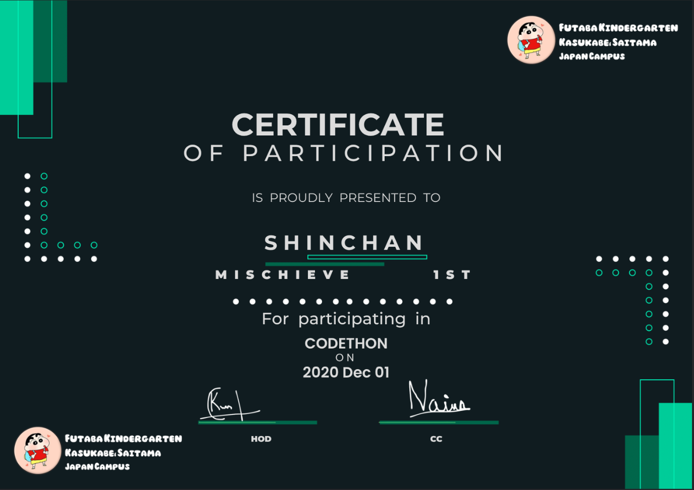

# 🎓 Automated Certificate Generator

A **full-stack web application** that generates beautiful PDF certificates and directly emails them to participants based on CSV input.

- 🌐 **Frontend:** Svelte (lightning-fast and reactive UI)
- 🔥 **Backend:** Flask (PDF, CSV, Email handling)
- 🧾 **PDF Engine:** fpdf2 with custom fonts and templates

> 💡 Perfect for events like hackathons, webinars, workshops, or university fests.

---

## 📸 Demo



---

## 🚀 Features

✅ Generate stylish PDF certificates  
✅ Svelte-based user interface with live status updates  
✅ Use any `.ttf` or `.otf` font from the `fonts/` folder  
✅ Background image as certificate template  
✅ CSV upload for participant data  
✅ Customizable: name, event, date, class, signatures  
✅ Optional: Add QR codes to certificates  
✅ Email delivery directly to user inbox  
✅ Clean and modular code structure

---

## 🧰 Tech Stack

### 🖼 Frontend
- ⚡️ [Svelte](https://svelte.dev/) – Reactive UI
- 📦 Vite – Fast bundler
- 🎨 Tailwind CSS (optional) – For styling (if used)

### 🧠 Backend
- 🐍 Python 3.10+
- 🔥 Flask – API routes and certificate logic
- 🖨 fpdf2 – Modern PDF generation
- 📧 smtplib/email – Sending certificates
- 📊 pandas – Parsing CSV files
- 🖼️ Pillow – (optional) Image support

---

## 🖼 Project Structure

```text
project/
│
├── frontend/ (Svelte App)
│ ├── src/
│ │ ├── pages/
│ │ │ └── Home.svelte ← Upload CSV and trigger cert generation
│ │ └── App.svelte
│ │ └── Navigation.svelte
│ └── public/
│
├── backend/ (Flask App)
│ ├── PythonTasksScripts/
│ │ ├── genPdf.py ← Core certificate generation logic
│ │ ├── sendingMails.py
│ │ ├── getFonts.py
│ │ └── csvFunc.py
│ │ └── designTemplate.py
│ ├── app.py ← Flask app entrypoint
│ ├── requirements.txt
│ ├── .flaskenv 
│ ├── fonts/ ← All static .ttf / .otf fonts
│ └── static/Images/...
│
└── README.md
```

---

## 💻 How to Run

### 1. Backend (Flask)

```bash


cd backend

------ For Linux ------
    python3 -m venv env
    source env/bin/activate

------ For Windows ------
    python -m venv env
    env\Scripts\activate

pip install -r requirements.txt
python app.py

```

### 2. Frontend (Svelte)

```bash


cd frontend
npm install
npm run dev

```


